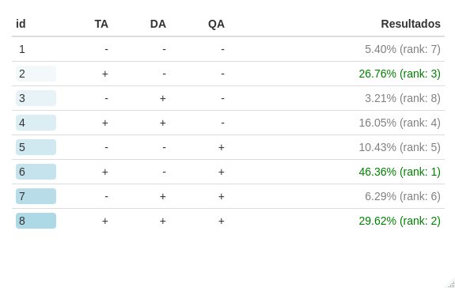
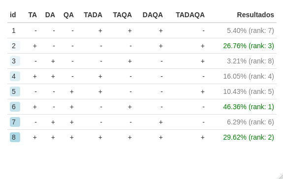
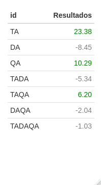
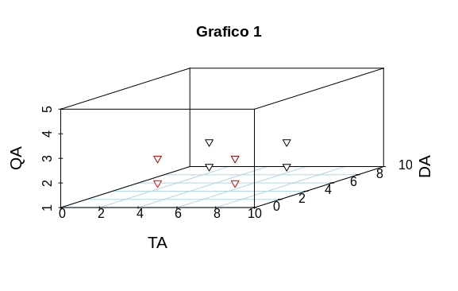
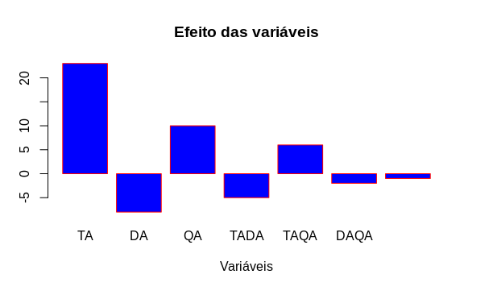

# Planejamento Fatorial Agulha de Buffon

Repositório para o trabalho de planejamento fatorial da disciplina de estatística, utilizando o problema da agulha de buffon para realizar análise do impacto das variáveis de tamanho da agulha, distância entre as linhas e quantidade de agulhas lançadas para sucesso único, utilizando sistema monte carlo para realizar o calculo de probabilidade.

## Script que realiza os calculos do efeito das varíaveis selecionadas
```r
buffon = function(needle_size, lines_size, isTwoNeedles){
  simulations = 1000000
  success = 0
  for(i in 1:simulations){
    needle_head_1 = sample(1:lines_size, 1)
    needle_angle_1 = sample(1: 360, 1)
    x_axis_projection_1 = sin(needle_angle_1) * needle_size
    
    if(isTwoNeedles == T){
      needle_head_2 = sample(1:lines_size, 1)
      needle_angle_2 = sample(1: 360, 1)
      x_axis_projection_2 = sin(needle_angle_2) * needle_size
    }
    else{
      needle_head_2 = needle_head_1
      needle_angle_2 = needle_angle_1
      x_axis_projection_2 = x_axis_projection_1
    }
    
    if(x_axis_projection_1 + needle_head_1 >= lines_size || x_axis_projection_2 + needle_head_2 >= lines_size ){
      success = success + 1
    }
  }
  probability = (success / simulations)*100
  return(probability)
}

min_needle = 1000
max_needle = 5000
min_line = 6000
max_line = 10000
isOne = F
isTwo = T

table = c()

# - - -
experiment = buffon(min_needle, min_line, isOne)
table = append(table, experiment)

# + - -
experiment = buffon(max_needle, min_line, isOne)
table = append(table, experiment)

# - + -
experiment = buffon(min_needle, max_line, isOne)
table = append(table, experiment)

# + + -
experiment = buffon(max_needle, max_line, isOne)
table = append(table, experiment)

#  - - + 
experiment = buffon(min_needle, min_line, isTwo)
table = append(table, experiment)

# + - +
experiment = buffon(max_needle, min_line, isTwo)
table = append(table, experiment)

#  - + + 
experiment = buffon(min_needle, max_line, isTwo)
table = append(table, experiment)

#  + + + 
experiment = buffon(max_needle, max_line, isTwo)
table = append(table, experiment)

print(table)

# Calculating the effect

needle_effect = ((table[1]*-1) + table[2] + (table[3]*-1) + table[4] + (table[5]*-1) + table[6] + (table[7]*-1) + table[8])/4
print(needle_effect)

line_effect = ((table[1]*-1) + (table[2]*-1) + table[3] + table[4] + (table[5]*-1) + (table[6]*-1) + table[7] + table[8])/4
print(line_effect)

quantity_effect = ((table[1]*-1) + (table[2]*-1) + (table[3]*-1) + (table[4]*-1) + table[5] + table[6] + table[7] + table[8])/4
print(quantity_effect)

neddle_line_effect = (table[1] + (table[2]*-1) + (table[3]*-1) + table[4] + table[5] + (table[6]*-1) + (table[7]*-1) + table[8])/4
print(neddle_line_effect)

needle_quantity_effect = (table[1] + (table[2]*-1) + table[3] + (table[4]*-1) + (table[5]*-1) + table[6] + (table[7]*-1) + table[8])/4
print(needle_quantity_effect)

line_quantity_effect = (table[1] + table[2] + (table[3]*-1) + (table[4]*-1) + (table[5]*-1) + (table[6]*-1) + table[7] + table[8])/4
print(line_quantity_effect)

needle_line_quantity_effect = ((table[1]*-1) + table[2] + table[3] + (table[4]*-1) + table[5] + (table[6]*-1) + (table[7]*-1) + table[8])/4
print(needle_line_quantity_effect)
```

### Saida do programa


## Código para gerar a tabela 1
```r
library(formattable)

df <- data.frame(
  id = 1:8, 
  TA = c("-", "+", "-", "+", "-","+","-","+"),
  DA = c("-", "-", "+", "+", "-","-","+","+"),
  QA = c("-", "-", "-", "-", "+","+","+","+"),
  Resultados = accounting(c(5.4037,26.7566,3.2092,16.0482,10.4334,46.3632,6.2859,29.6184), digits = 6,format = "f")
  )


formattable(df,align = c("l",rep("r", NCOL(df) - 1)),
            list(
  id = color_tile("white", "lightblue"),

  Resultados =formatter("span",
            style = x ~ style(color = ifelse(rank(-x) <= 3, "green", "gray")),
            x ~ sprintf("%.2f%s (rank: %2g)", x,'%',rank(-x)))
  
))
```

### Saida do programa



## Código para gerar a tabela 2

```r
library(formattable)

df <- data.frame(
  id = 1:8, 
  TA = c("-", "+", "-", "+", "-","+","-","+"),
  DA = c("-", "-", "+", "+", "-","-","+","+"),
  QA = c("-", "-", "-", "-", "+","+","+","+"),
  
  TADA = c("+", "-", "-", "+", "+","-","-","+"),
  TAQA = c("+", "-", "+", "-", "-","+","-","+"),
  DAQA = c("+", "+", "-", "-", "-","-","+","+"),
  TADAQA = c("-", "+", "+", "-", "+","-","-","+"),
  Resultados = accounting(c(5.4037,26.7566,3.2092,16.0482,10.4334,46.3632,6.2859,29.6184), digits = 6,format = "f")
)


formattable(df,align = c("l",rep("r", NCOL(df) - 1)),
            list(
              id = color_tile("white", "lightblue"),
              
              Resultados =formatter("span",
                                    style = x ~ style(color = ifelse(rank(-x) <= 3, "green", "gray")),
                                    x ~ sprintf("%.2f%s (rank: %2g)", x,'%',rank(-x)))
              
            ))
```

### Saida do programa




## Código para gerar a tabela 3

```r
library(formattable)

df <- data.frame(
  id = c("TA","DA","QA","TADA","TAQA","DAQA","TADAQA"), 

  Resultados = accounting(c(23.3846,-8.4491, 10.2907, -5.3382,6.2021,-2.0374,-1.0286), digits = 6,format = "f")
)


formattable(df,align = c("l",rep("r", NCOL(df) - 1)),
            list(
              #id = color_tile("white", "lightblue"),
              
              Resultados =formatter("span",
                                    style = x ~ style(color = ifelse(rank(-x) <= 3, "green", "gray")),
                                    x ~ sprintf("%.2f", x )
              
            )))
```

### Saida do programa



## Ploter do gráfico

```r
library(scatterplot3d)

temp <- seq(-pi, 0, length = 50)
x <- c(1, 5, 1, 5, 1,5,1,5)
y <- c(6, 6,10,10,6,6,10,10)
z <- c(1,1,1,1,2,2,2,2)
scatterplot3d(x, y, z, highlight.3d = TRUE, angle = 750,  xlim=c(1,10) , ylim=c(1,10), zlim=c(1,5),
              xlab ="TA" , ylab ="DA", zlab ="QA" ,
              col.axis = "black", col.grid = "lightblue", cex.axis = 1.0,
              cex.lab = 1.3, main = "Grafico 1", pch = 25)
 ```
 
 ### Saída do programa

 
 
 ## Ploter do gráfico dos efeitos da variáveis
 
```r
# Create the data for the chart
L <- c(23, -8, 10, -5, 6, -2, -1)
M <- c("TA","DA","QA","TADA","TAQA", "DAQA", "TADAQA")

barplot(L,names.arg=M,xlab="Variáveis",ylab="Efeito",col="blue",
        main="Efeito das variáveis",border="red")
```

 ### Saída do programa
 
 
