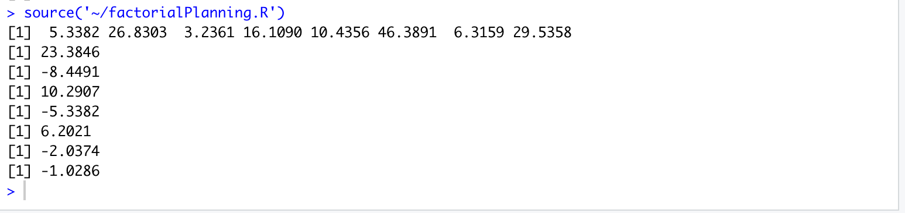

# Planejamento Fatorial Agulha de Buffon

Repositório para o trabalho de planejamento fatorial da disciplina de estatística, utilizando o problema da agulha de buffon para realizar análise do impacto das variáveis de tamanho da agulha, distância entre as linhas e quantidade de agulhas lançadas para sucesso único, utilizando sistema monte carlo para realizar o calculo de probabilidade.

## Script que realiza os calculos do efeito das varíaveis selecionadas
```r
buffon = function(needle_size, lines_size, isTwoNeedles){
  simulations = 1000000
  success = 0
  for(i in 1:simulations){
    needle_head_1 = sample(1:lines_size, 1)
    needle_angle_1 = sample(1: 360, 1)
    x_axis_projection_1 = sin(needle_angle_1) * needle_size
    
    if(isTwoNeedles == T){
      needle_head_2 = sample(1:lines_size, 1)
      needle_angle_2 = sample(1: 360, 1)
      x_axis_projection_2 = sin(needle_angle_2) * needle_size
    }
    else{
      needle_head_2 = needle_head_1
      needle_angle_2 = needle_angle_1
      x_axis_projection_2 = x_axis_projection_1
    }
    
    if(x_axis_projection_1 + needle_head_1 >= lines_size || x_axis_projection_2 + needle_head_2 >= lines_size ){
      success = success + 1
    }
  }
  probability = (success / simulations)*100
  return(probability)
}

min_needle = 1000
max_needle = 5000
min_line = 6000
max_line = 10000
isOne = F
isTwo = T

table = c()

# - - -
experiment = buffon(min_needle, min_line, isOne)
table = append(table, experiment)

# + - -
experiment = buffon(max_needle, min_line, isOne)
table = append(table, experiment)

# - + -
experiment = buffon(min_needle, max_line, isOne)
table = append(table, experiment)

# + + -
experiment = buffon(max_needle, max_line, isOne)
table = append(table, experiment)

#  - - + 
experiment = buffon(min_needle, min_line, isTwo)
table = append(table, experiment)

# + - +
experiment = buffon(max_needle, min_line, isTwo)
table = append(table, experiment)

#  - + + 
experiment = buffon(min_needle, max_line, isTwo)
table = append(table, experiment)

#  + + + 
experiment = buffon(max_needle, max_line, isTwo)
table = append(table, experiment)

print(table)

# Calculating the effect

needle_effect = ((table[1]*-1) + table[2] + (table[3]*-1) + table[4] + (table[5]*-1) + table[6] + (table[7]*-1) + table[8])/4
print(needle_effect)

line_effect = ((table[1]*-1) + (table[2]*-1) + table[3] + table[4] + (table[5]*-1) + (table[6]*-1) + table[7] + table[8])/4
print(line_effect)

quantity_effect = ((table[1]*-1) + (table[2]*-1) + (table[3]*-1) + (table[4]*-1) + table[5] + table[6] + table[7] + table[8])/4
print(quantity_effect)

neddle_line_effect = (table[1] + (table[2]*-1) + (table[3]*-1) + table[4] + table[5] + (table[6]*-1) + (table[7]*-1) + table[8])/4
print(neddle_line_effect)

needle_quantity_effect = (table[1] + (table[2]*-1) + table[3] + (table[4]*-1) + (table[5]*-1) + table[6] + (table[7]*-1) + table[8])/4
print(needle_quantity_effect)

line_quantity_effect = (table[1] + table[2] + (table[3]*-1) + (table[4]*-1) + (table[5]*-1) + (table[6]*-1) + table[7] + table[8])/4
print(line_quantity_effect)

needle_line_quantity_effect = ((table[1]*-1) + table[2] + table[3] + (table[4]*-1) + table[5] + (table[6]*-1) + (table[7]*-1) + table[8])/4
print(needle_line_quantity_effect)

```

### Saida do programa


